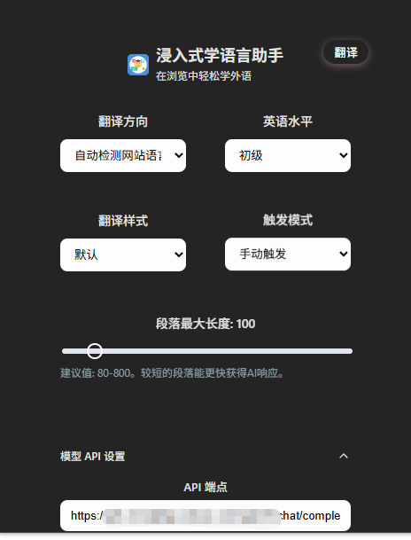
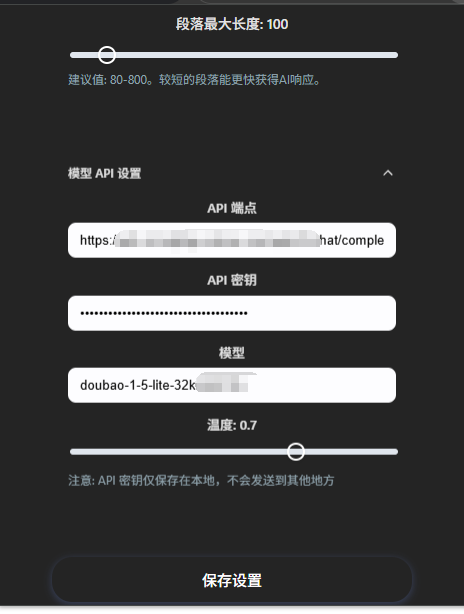
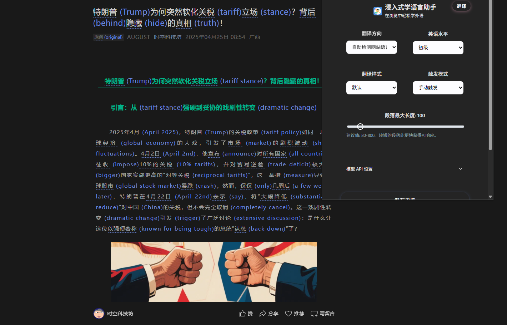
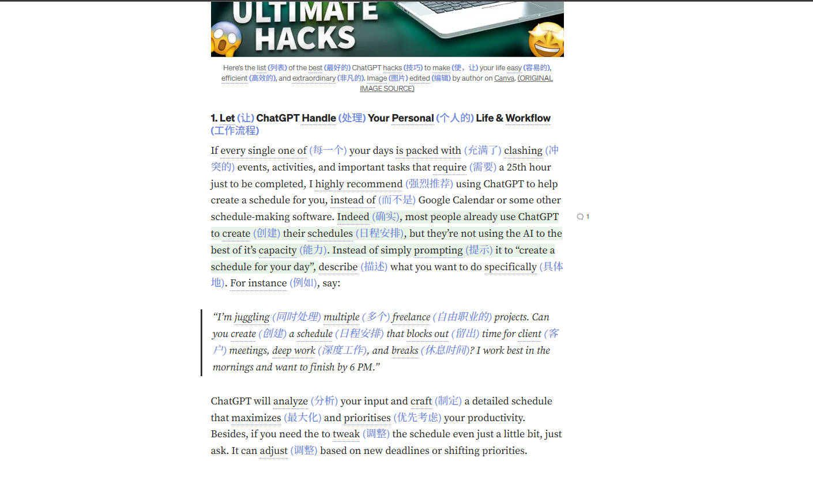

# 浸入式学语言助手 (Immersive Language Learning Assistant)


> A browser extension based on the "comprehensible input" theory to help you learn languages naturally while browsing the web.
>
> 一款基于"可理解输入"理论的浏览器扩展，帮助你在日常网页浏览中自然地学习语言。

---

## ✨ 核心理念 (Core Philosophy)

我坚信，语言学习的最佳途径是大量接触"可理解的"输入材料，即著名的 **"i+1"** 理论。这意味着内容应该略高于你当前的水平，既有挑战性，又不至于让你完全看不懂。本扩展旨在将整个互联网变成你的个性化语言学习教材，通过智能地将网页上的部分词语替换为你正在学习的目标语言词汇，让你在沉浸式的阅读中，不知不觉地提升词汇量和语感。

> **English**: We firmly believe that the best way to learn a language is through extensive exposure to "comprehensible input," the famous **"i+1"** theory. This means content should be slightly above your current level—challenging but not incomprehensible. This extension aims to turn the entire internet into your personalized language learning material by intelligently replacing selected words with their translations in your target language, allowing you to naturally improve your vocabulary and language intuition while immersed in reading.

## 🚀 功能特性 (Features)

- **智能文本替换**: 自动识别网页内容，并将部分词语替换为对应的目标语言翻译。
- **高度可配置**:
  - **语言水平**: 从初级到精通，五个级别可供选择，以匹配您当前的词汇量。
  - **翻译方向**: 支持多种语言之间的互译，以及"自动检测网页语言"模式。
  - **翻译样式**: 提供默认、下划线、粗体、斜体、高亮和微妙等多种样式，让翻译结果以你最喜欢的方式呈现。
  - **触发模式**: 可设置为"自动触发"（页面加载时自动处理）或"手动触发"。
  - **段落长度**: 自定义AI单次处理的最大文本长度，以平衡速度和上下文的完整性。
- **自定义 API**: 完全支持接入任何与 OpenAI API 兼容的第三方服务。您可以自由配置：
  - API Key
  - API Endpoint
  - 模型名称 (e.g., `gpt-4`, `doubao-1-5-lite-32k-250115`)
  - 温度 (Temperature)
- **优雅的 UI/UX**:
  - 一个美观、响应迅速的弹窗界面，用于管理所有设置。
  - 为新出现的翻译词汇提供柔和的"辉光"提示，不打扰阅读。
  - 为被翻译的原文提供可自定义的下划线，清晰标记。
- **现代技术栈**: 使用 Vue 3, TypeScript, 和 [WXT](https://wxt.dev/) 构建，提供流畅的性能和良好的开发体验。

## 🌐 浏览器兼容性 (Browser Compatibility)

本扩展基于 [Web Extension API](https://developer.mozilla.org/en-US/docs/Mozilla/Add-ons/WebExtensions) 和 [WXT](https://wxt.dev/) 构建，支持以下浏览器：

| 浏览器 (Browser) | 支持状态 (Status) |
|----------------|------------------|
| Chrome         | ✅ 完全支持 (Fully Supported) |
| Edge           | ✅ 完全支持 (Fully Supported) |
| Firefox        | ✅ 支持 (Supported) |
| Safari         | ⚠️ 部分支持 (Partially Supported) |

> **注意**: 在 Safari 上可能需要额外的配置步骤，详见 [Safari 扩展指南](#safari-扩展安装)。

## 📸 功能展示 (Screenshots)

<div align="center">
  
  
  
  
  
  <p><i>扩展的主界面及设置选项 (Main interface and settings)</i></p>
</div>


  
## 🛠️ 安装与运行 (Getting Started)

### 1. 先决条件 (Prerequisites)

- [Node.js](https://nodejs.org/) (version 18 or higher)
- [pnpm](https://pnpm.io/installation)

### 2. 安装 (Installation)

1.  **克隆仓库 (Clone the repository):**
    
    ```bash
    git clone https://github.com/xiao-zaiyi/illa-helper.git
    cd illa-helper
    ```
    
2.  **安装依赖 (Install dependencies):**
    
    ```bash
    npm install
    ```
    
> **提示**: 如果你只想使用这个扩展而不参与开发，请直接前往 [Releases](https://github.com/your-username/immersive-language-learning-assistant/releases) 页面下载最新版本的打包文件。

### 3. 配置 (Configuration)

项目通过 `.env` 文件管理本地开发环境的配置。

1.  **创建 `.env` 文件 (Create your .env file):**
    复制 `.env.example` 文件来创建你自己的本地配置文件。
    ```bash
    cp .env.example .env
    ```

2.  **修改配置 (Edit your configuration):**
    打开新建的 `.env` 文件，至少你需要提供一个有效的 API Key 才能让翻译功能正常工作。
    ```env
    VITE_WXT_DEFAULT_API_KEY="sk-your-real-api-key"
    # 你也可以在这里覆盖其他的默认设置
    VITE_WXT_DEFAULT_API_ENDPOINT="https://xxxxx/api/v1/chat/completions"
    VITE_WXT_DEFAULT_MODEL="gpt-4"
    ```
    > **注意**: `.env` 文件已被添加到 `.gitignore` 中，所以你的密钥不会被意外提交。

### 4. 运行开发环境 (Run in Development)

执行以下命令，WXT 将会启动开发服务器并为你打包扩展。

```bash
npm run build 
npm run zip
```

### 5. 加载扩展 (Load the Extension)

1.  打开你的浏览器 (Chrome, Edge, Firefox 等)。
2.  进入扩展管理页面 (通常是 `chrome://extensions` 或 `edge://extensions`)。
3.  打开 **"开发者模式" (Developer mode)**。
4.  点击 **"加载已解压的扩展程序" (Load unpacked)**。
5.  在弹出的文件选择窗口中，选择项目根目录下的 `.output/chrome-mv3/illa-helper-xx.zip` (或对应你浏览器的文件夹)。
6.  完成！现在你应该能在浏览器工具栏看到扩展的图标了。

## 📂 项目结构 (Project Structure)

```
.
├── .output/              # WXT 打包后的输出目录
├── .vscode/              # VS Code 编辑器配置
├── entrypoints/          # 扩展的入口文件
│   ├── background.ts     # Background Service Worker
│   ├── content.ts        # 内容脚本 (核心逻辑)
│   └── popup/            # 弹窗 UI (Vue 组件)
├── public/               # 公共静态资源 (图标等)
├── src/                  # 源代码
│   └── modules/          # 各个功能模块 (类型定义, API 服务, 存储管理等)
├── .env                  # (本地) 环境变量，不提交
├── .env.example          # 环境变量模板
├── package.json
├── pnpm-lock.yaml
├── README.md             
└── wxt.config.ts         # WXT 配置文件
```

## ❓ 常见问题 (FAQ)

### 为什么我需要提供API密钥？(Why do I need to provide an API key?)

本扩展使用AI技术进行智能文本翻译，这需要调用API服务。您可以使用OpenAI的API密钥，或任何兼容OpenAI API格式的第三方服务。

> **English**: This extension uses AI technology for intelligent text translation, which requires an API service. You can use OpenAI's API key or any third-party service that's compatible with OpenAI's API format.

### 扩展会收集我的浏览数据吗？(Will the extension collect my browsing data?)

不会。本扩展在本地处理所有网页内容，只将需要翻译的文本片段发送到配置的API服务。不会收集或存储您的浏览历史或个人数据。

> **English**: No. This extension processes all webpage content locally and only sends text fragments that need translation to your configured API service. do not collect or store your browsing history or personal data.

### 我可以控制翻译比例吗？(Can I control the translation ratio?)

可以。通过设置中的"语言水平"选项，您可以调整词汇替换的难度和比例，从初学者(较少替换)到高级(较多替换)不等。

> **English**: Yes. Through the "Language Level" option in settings, you can adjust the difficulty and proportion of vocabulary replacements, ranging from beginner (fewer replacements) to advanced (more replacements).

### Safari浏览器如何安装？<a id="safari-扩展安装"></a>(How to install on Safari?)

Safari需要额外的步骤将Web扩展打包为Safari扩展。请参考[Apple开发者文档](https://developer.apple.com/documentation/safariservices/safari_web_extensions/converting_a_web_extension_for_safari)。

> **English**: Safari requires additional steps to package Web Extensions as Safari extensions. Please refer to [Apple's developer documentation](https://developer.apple.com/documentation/safariservices/safari_web_extensions/converting_a_web_extension_for_safari).

## 🤝 贡献指南 (Contributing)

我们非常欢迎各种形式的贡献！无论是提交 Bug、提出新功能建议，还是直接贡献代码。

### 如何贡献 (How to Contribute)

1. **提交问题 (Submit Issues)**
   - 使用 GitHub Issues 报告 bug 或提出功能建议
   - 清晰描述问题或建议的详细内容
   - 如果是 bug，请提供复现步骤和环境信息

2. **贡献代码 (Contribute Code)**
   - **Fork** 本仓库
   - 创建一个新的分支 (`git checkout -b feature/your-amazing-feature`)
   - 编写并测试您的代码
   - 确保代码遵循项目的编码规范
   - 提交您的代码更改 (`git commit -m 'Add some amazing feature'`)
   - 将您的分支推送到远程仓库 (`git push origin feature/your-amazing-feature`)
   - 创建一个 **Pull Request**

3. **改进文档 (Improve Documentation)**
   - 文档改进对项目同样重要
   - 可以修正错别字、完善解释或添加示例

### 开发指南 (Development Guidelines)

- 请确保所有代码通过TypeScript类型检查
- 遵循项目已有的代码风格和组织结构
- 添加新功能时考虑兼容性和性能
- 保持代码简洁，功能直观

> **英文 (English)**: We welcome contributions of all kinds! Whether reporting bugs, suggesting new features, or directly contributing code. Please fork the repository, create a new branch for your work, and submit a pull request when ready. Make sure to follow the project's coding style and test your changes thoroughly.

## 📜 版权许可 (License)

本项目基于 [MIT License](./LICENSE) 开源。您可以自由使用、修改和分发此代码，包括用于商业目的。

> **English**: This project is open-sourced under the [MIT License](./LICENSE). You are free to use, modify, and distribute this code, including for commercial purposes.

