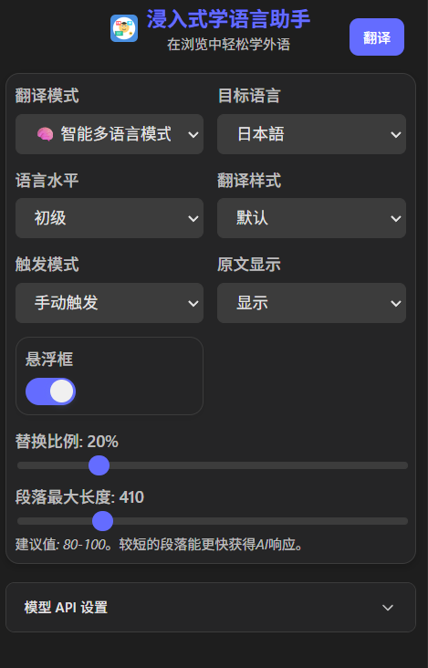
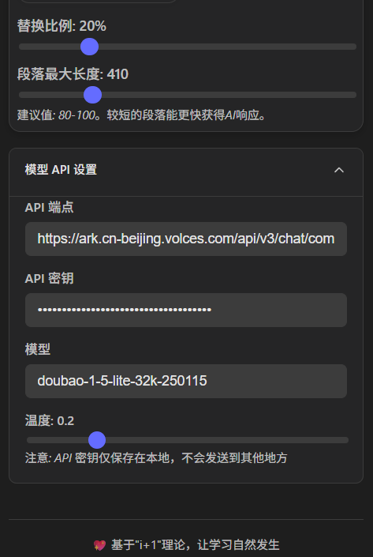
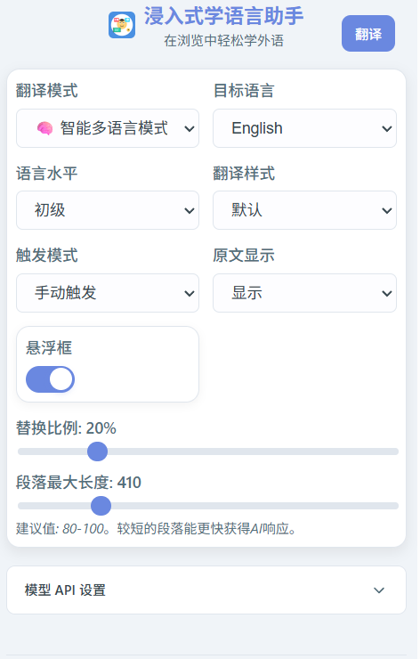
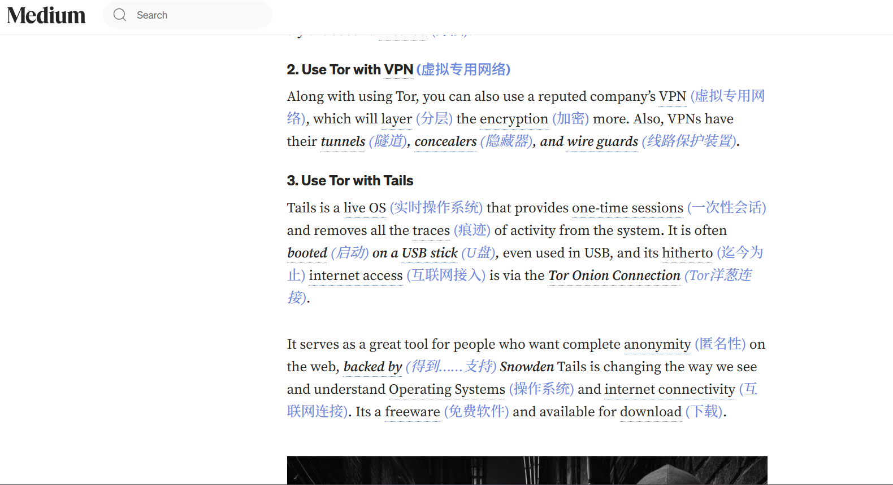
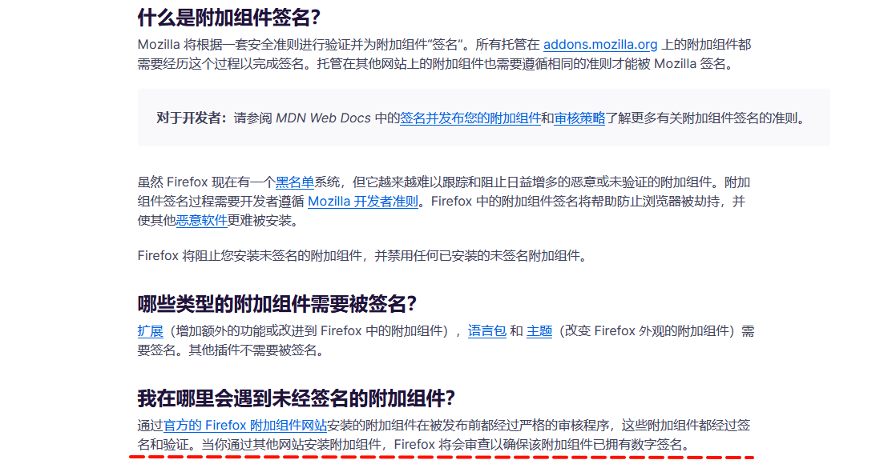

# Immersive Language Learning Assistant

<div align="center">

</div>
<div align="center">


</div>

> A browser extension based on the "comprehensible input" theory to help you learn languages naturally while browsing the web.

English | [简体中文](./README_ZH.md)

## ✨ Core Philosophy

We firmly believe that the best way to learn a language is through extensive exposure to "comprehensible input," the famous **"i+1"** theory. This means content should be slightly above your current level—challenging but not incomprehensible. This extension aims to turn the entire internet into your personalized language learning material by intelligently replacing selected words with their translations in your target language, allowing you to naturally improve your vocabulary and language intuition while immersed in reading.

**🎯 Project Highlights**: Features a complete pronunciation learning ecosystem with intelligent multi-language translation, including automatic language detection, phonetic notation, AI definitions, dual TTS support, and interactive tooltips for a comprehensive one-stop immersive experience from smart translation to pronunciation learning.

> 📚 **Complete Documentation**: See [Architecture & Features Guide](./docs/ARCHITECTURE_AND_FEATURES.md) for technical architecture, API reference, development guide, and troubleshooting.

## 🚀 Features

### 🎯 Core Translation Engine
- **Intelligent Language Detection**: AI automatically identifies webpage source language, no need for users to manually specify language type
- **Intelligent Text Processing**: Uses AI large language models to analyze webpage content and intelligently select vocabulary suitable for user proficiency levels
- **Precise Replacement Control**: Precisely control translation ratio (1%-100%) with character-based calculation support
- **Context Awareness**: Considers context and user level to select the most appropriate translation vocabulary
- **Multi-language Support**: Supports 20+ languages intelligent translation (English, Japanese, Korean, French, German, Spanish, Russian, Italian, Portuguese, Dutch, Swedish, Norwegian, Danish, Finnish, Polish, Czech, Turkish, Greek, etc.) **theoretically depends on AI model capabilities**.

### 🔊 Pronunciation Learning Ecosystem ⭐
- **Interactive Pronunciation Tooltips**: Hover over translated words to view phonetics, AI definitions, and pronunciation features with intelligent positioning to avoid boundary overflow
- **Dual-layer Learning Experience**: Phrases display interactive word lists, click individual words for detailed information with nested tooltip support
- **Multi-TTS Service Support**: Integrates Youdao TTS (high quality) and Web Speech API (backup), supports British/American pronunciation switching
- **Smart Phonetic Retrieval**: Automatically retrieves Dictionary API phonetic data with 24-hour TTL caching for optimized performance
- **AI Definition Explanations**: Real-time AI-generated Chinese definitions for more accurate understanding with contextual analysis support
- **Progressive Loading**: Display basic information first, then asynchronously load detailed content to optimize user experience
- **Audio Caching**: Memory-level TTS audio caching, no need to regenerate audio for the same word

### 🎨 Rich Visual Experience
- **7 Translation Styles**: Default, subtle, bold, italic, underlined, highlighted, learning mode (blur effect)
- **Learning Mode**: Translation words initially displayed blurred, clarified on hover to enhance memory effect
- **Glow Animation**: Gentle hint effects when new translated words appear, non-intrusive to reading experience
- **Responsive Design**: Auto-adapts to dark/light themes with intelligent tooltip positioning

### ⚙️ Highly Configurable
- **Smart Translation Mode**: Users only need to select target language, AI automatically detects source language and translates
- **User Level Adaptation**: 5 levels from beginner to advanced with AI-intelligent vocabulary difficulty and selection strategy adjustment
- **Trigger Modes**: Supports automatic trigger (process on page load) and manual trigger working modes
- **Original Text Display Control**: Choose to show, hide, or learning mode (blur effect) display of translated original text
- **Paragraph Length Control**: Customize maximum text length for AI single processing
- **Pronunciation Feature Toggle**: Independent control of pronunciation tooltip functionality activation status

### 🔌 Open API Integration
- **OpenAI API Compatible**: Supports any AI service compatible with OpenAI format (ChatGPT, Claude, domestic large models like Doubao, etc.)
- **Flexible Configuration**: Customize API Key, Endpoint, model name, Temperature parameters
- **Smart Prompts**: Dynamically generate optimal prompts based on translation direction and user level
- **Error Handling**: Comprehensive API error handling and retry mechanisms

### 🚀 Performance & Optimization
- **Smart Caching**: Multi-level caching strategy for translation results, phonetic data, and TTS audio
- **Incremental Processing**: Only processes new content, avoiding duplicate translations
- **DOM Safety**: Uses Range API to ensure DOM structure integrity
- **Memory Management**: Timely cleanup of listeners and optimized memory usage

### 💻 Modern Technical Architecture
- **Tech Stack**: Vue 3 + TypeScript + WXT Framework
- **Modular Design**: High cohesion, low coupling modular architecture, easy to maintain and extend
- **Cross-browser Compatibility**: Supports Chrome, Edge, Firefox, partial support for Safari

## 🌐 Browser Compatibility

This extension is built with [Web Extension API](https://developer.mozilla.org/en-US/docs/Mozilla/Add-ons/WebExtensions) and [WXT](https://wxt.dev/), supporting the following browsers:

| Browser | Support Status | Notes |
|---------|----------------|-------|
| Chrome  | ✅ Fully Supported | Recommended environment, all features available |
| Edge    | ✅ Fully Supported | Chromium-based, full compatibility |
| Firefox | ✅ Supported | Requires addon ID configuration, see [Firefox Installation Guide](#firefox-installation-guide) |
| Safari  | ⚠️ Partially Supported | Requires additional configuration |

## ⚡ Performance Features

### 🚀 Smart Caching System
- **Translation Results**: Smart caching based on content and settings, avoiding duplicate API calls
- **Phonetic Data**: 24-hour TTL local caching for improved response speed
- **TTS Audio**: Memory-level caching, no need to regenerate audio for the same word

### 🔄 Incremental Processing Mechanism
- **DOM Monitoring**: Only processes new content, avoiding duplicate translations
- **Debounce Optimization**: Smart delayed processing for dynamic content changes
- **Range API**: Precise DOM operations maintaining page structure integrity

## 📸 Feature Showcase

### 🎬 Dynamic Demo
<div align="center">
  
  <p><i>🎯 Complete Demo: One-stop immersive experience from smart translation to pronunciation learning</i></p>
</div>

### 🎨 Theme Adaptation
<div style="width:100%" align="center">
  
  
  
  <p><i>🌗 Theme Adaptation: Smart dark/light theme switching with modern visual experience</i></p>
</div>

### 🌍 Multi-language Learning Scenarios
<div style="width:100%" align="center">
  
  
  <br/>
  
  
  <p><i>🧠 Smart Multi-language: AI automatic detection and translation for 20+ languages, covering mainstream learning languages including Chinese, English, Japanese, Korean, etc.</i></p>
</div>

## 🛠️ Installation & Setup

### 1. Prerequisites

- [Node.js](https://nodejs.org/) (version 18 or higher)
- [npm](https://nodejs.org/) or other package managers

### 2. Installation

1.  **Clone the repository:**
    
    ```bash
    git clone https://github.com/xiao-zaiyi/illa-helper.git
    cd illa-helper
    ```
    
2.  **Install dependencies:**
    
    ```bash
    npm install
    ```
    
> **Tip**: If you just want to use this extension without participating in development, please go directly to the [Releases](https://github.com/xiao-zaiyi/illa-helper/releases) page to download the latest packaged version.

### 3. Configuration

The project manages local development environment configuration through `.env` files.

1.  **Create .env file:**
    Copy the `.env.example` file to create your own local configuration file.
    ```bash
    cp .env.example .env
    ```

2.  **Edit configuration:**
    Open the newly created `.env` file. At minimum, you need to provide a valid API Key for the translation function to work properly.
    ```env
    VITE_WXT_DEFAULT_API_KEY="sk-your-real-api-key"
    # You can also override other default settings here
    VITE_WXT_DEFAULT_API_ENDPOINT="https://xxxxx/api/v1/chat/completions"
    VITE_WXT_DEFAULT_MODEL="gpt-4"
    VITE_WXT_DEFAULT_TEMPERATURE="0.2"
    ```
    > **Note**: The `.env` file has been added to `.gitignore`, so your keys won't be accidentally committed.

### 4. Build Extension

Execute the appropriate build commands based on your target browser:

#### Chrome/Edge Build
```bash
npm run build
npm run zip
```

#### Firefox Build
```bash
npm run build:firefox
npm run zip:firefox
```

### 5. Load Extension

#### Chrome/Edge Installation
1. Open your browser (Chrome, Edge, etc.)
2. Go to the extension management page (`chrome://extensions` or `edge://extensions`)
3. Turn on **"Developer mode"**
4. Click **"Load unpacked"**
5. Select the `.output/chrome-mv3` folder in the project root directory
6. Done! You should now see the extension icon in your browser toolbar

#### Firefox Installation Guide <a id="firefox-installation-guide"></a>

Firefox requires special installation steps due to security restrictions:

**Method 1: Temporary Installation (Recommended for Development)**
1. Enter `about:debugging#/runtime/this-firefox` in Firefox address bar
2. Click **"Load Temporary Add-on..."**
3. Select the `.output/firefox-mv2/manifest.json` file
4. Extension will be loaded temporarily and needs to be reloaded after browser restart

**Method 2: Modify Security Configuration (Permanent Installation)**
1. Enter `about:config` in Firefox address bar
2. Search for `xpinstall.signatures.required`
3. Double-click to change the value to `false`
4. Now you can install unsigned extensions through `about:addons`

**Firefox Storage API Configuration**

The storage API in Firefox requires an explicit addon ID to work properly. This project has configured Firefox-specific settings in `wxt.config.ts`:

```typescript
browser_specific_settings: {
  gecko: {
    id: 'illa-helper@xiao-zaiyi',
    strict_min_version: '88.0'
  }
}
```

This ensures proper storage functionality for saving user settings in Firefox.

## 📂 Directory Structure

```
.
├── .output/              # WXT build output directory
│   ├── chrome-mv3/       # Chrome/Edge extension files
│   └── firefox-mv2/      # Firefox extension files
├── entrypoints/          # Extension entry points
│   ├── background.ts     # Background service (config validation, notification management)
│   ├── content.ts        # Content script (core translation logic)
│   ├── popup/            # Vue 3 popup interface
│   │   ├── App.vue       # Main interface component
│   │   └── index.html    # Popup page
│   └── options/          # Settings page (Vue 3)
│       ├── App.vue       # Settings main interface
│       └── components/   # Settings page components
├── src/modules/          # Core functional modules
│   ├── pronunciation/    # 🔊 Pronunciation system module (complete ecosystem)
│   │   ├── phonetic/     # Phonetic retrieval services (Dictionary API)
│   │   ├── tts/          # Speech synthesis services (Youdao TTS + Web Speech)
│   │   ├── translation/  # AI translation integration (definition explanations)
│   │   ├── services/     # Pronunciation service coordinator (core logic)
│   │   ├── ui/           # Tooltip UI components (interactive interface)
│   │   ├── utils/        # Utility function library (DOM, positioning, timer)
│   │   ├── config/       # Configuration management (constants, config items)
│   │   └── types/        # Type definitions (complete type system)
│   ├── options/          # Settings management module
│   │   └── blacklist/    # Website blacklist functionality
│   ├── processing/       # Text processing module
│   ├── floatingBall/     # Floating ball functionality
│   ├── apiService.ts     # AI translation API service
│   ├── textProcessor.ts  # Smart text processor
│   ├── textReplacer.ts   # Text replacement engine
│   ├── styleManager.ts   # Style manager
│   ├── storageManager.ts # Configuration storage management
│   ├── languageManager.ts# Multi-language support
│   ├── promptManager.ts  # AI prompt management
│   ├── messaging.ts      # Messaging system
│   └── types.ts          # Core type definitions
├── public/               # Static resources
│   ├── icon/             # Extension icons (16-128px)
│   └── warning.png       # Notification icon
├── docs/                 # 📚 Project documentation
│   └── ARCHITECTURE_AND_FEATURES.md  # Detailed technical documentation
├── .env.example          # Environment variable template
├── wxt.config.ts         # WXT framework configuration
└── package.json          # Project dependency configuration
```

### 🔧 Core Tech Stack

- **Framework**: [WXT](https://wxt.dev/) - Modern WebExtension development framework
- **Frontend**: Vue 3 + TypeScript + Vite
- **Build**: ESLint + Prettier + TypeScript compilation
- **API Integration**: OpenAI compatible interface + Dictionary API + Youdao TTS
- **Architecture Patterns**: Provider pattern + Modular design + Event-driven
- **Pronunciation System**: Factory pattern + Multi-TTS services + Smart caching
- **Storage Management**: Configuration version control + Cross-browser compatibility

> 📖 **Detailed Documentation**: [Architecture & Features Guide](./docs/ARCHITECTURE_AND_FEATURES.md) - Contains complete technical architecture, API reference, and development guide

## ❓ FAQ

### Why do I need to provide an API key?

This extension uses AI technology for intelligent text translation, which requires an API service. You can use OpenAI's API key or any third-party service that's compatible with OpenAI's API format.

### How does the pronunciation feature work?

Our pronunciation system is a core feature providing a complete learning experience:
- **Phonetic Display**: Automatically retrieves Dictionary API phonetic data
- **AI Definitions**: Real-time AI-generated Chinese definition explanations
- **Dual TTS Support**: Youdao TTS (high quality) + Web Speech API (backup)
- **Interactive Tooltips**: Hover to view, supports British/American pronunciation switching
- **Phrase Learning**: Each word in phrases can be independently viewed and pronounced

### How to use Smart Multi-language Mode?

Smart multi-language mode is our new feature, easy to use:
1. **Select Translation Mode**: Choose "🧠 Smart Multi-language Mode" in settings
2. **Select Target Language**: Choose your learning language from 20+ supported languages
3. **Start Browsing**: AI automatically detects webpage language and translates to your target language
4. **No Additional Configuration**: System automatically handles different language webpage content

### Will the extension collect my browsing data?

No. This extension processes all webpage content locally and only sends text fragments that need translation to your configured API service. Pronunciation function's phonetic and definition data are also cached locally to protect your privacy.

### Can I control the translation ratio?

Yes. The extension provides precise translation control:
- **Language Level**: 5 levels from beginner to advanced with AI-adjusted vocabulary difficulty
- **Replacement Ratio**: 1%-100% precise control with character-based calculation support
- **Original Text Display**: Choose to show, hide, or learning mode (blur effects)
- **Smart Adaptation**: In smart mode, system automatically optimizes translation strategy based on detected language

### How to install on Safari? <a id="safari-extension-installation"></a>

Safari requires additional steps to package Web Extensions as Safari extensions. Please refer to [Apple's developer documentation](https://developer.apple.com/documentation/safariservices/safari_web_extensions/converting_a_web_extension_for_safari).

### Firefox Issues Resolution 🚨

#### "Failed to get user settings: Error: The storage API will not work with a temporary addon ID"

This is a known limitation in Firefox. Solutions:

1. **Use Latest Version**: Ensure you're using the latest build version with Firefox-specific configuration
2. **Use Firefox-specific Build**: Run `npm run build:firefox && npm run zip:firefox`
3. **Temporary Installation**: Install through `about:debugging` page instead of directly installing .xpi file

#### "This component cannot be installed because it has not been verified"

- **Method 1**: Enter `about:debugging#/runtime/this-firefox` in address bar, select `Load Temporary Add-on...` to install Firefox extension from file
- **Method 2**: Enter `about:config` in address bar, search for `xpinstall.signatures.required`, double-click to change to `false`

<div align="center">
  
</div>

### API-related Issues

#### "API Configuration Error" Notification

Check the following configurations:
- API Key format correct (usually starts with `sk-`)
- API Endpoint URL validity
- Model name support
- Network connection status

#### Poor Translation Quality

You can try:
- Adjusting user level settings
- Modifying translation ratio
- Switching to more powerful AI models
- Adjusting Temperature parameter (recommended 0.1-0.3)

## 🛠️ Troubleshooting

### Common Problem Diagnosis

#### 1. Extension Loading Failed
- Check Node.js version (requires 18+)
- Ensure dependencies are completely installed: `npm install`
- Review build logs for errors

#### 2. Translation Function Not Working
- Verify API configuration correctness
- Check network connection
- Review developer console error messages

#### 3. Pronunciation Function Abnormal
- Ensure browser supports Web Speech API
- Check Youdao TTS service status
- Verify Dictionary API accessibility

#### 4. Settings Cannot Be Saved
- Firefox users confirm correct installation method
- Check extension permission settings
- Clear browser cache and retry

## 🤝 Contributing

We welcome contributions of all kinds! Whether reporting bugs, suggesting new features, or directly contributing code.

### How to Contribute

1. **Submit Issues**
   - Use GitHub Issues to report bugs or suggest features
   - Clearly describe the problem or suggestion details
   - If it's a bug, please provide reproduction steps and environment information

2. **Contribute Code**
   - **Fork** this repository
   - Create a new branch (`git checkout -b feature/your-amazing-feature`)
   - Write and test your code
   - Ensure code follows the project's coding standards
   - Commit your changes (`git commit -m 'Add some amazing feature'`)
   - Push your branch to the remote repository (`git push origin feature/your-amazing-feature`)
   - Create a **Pull Request**

3. **Improve Documentation**
   - Documentation improvements are equally important to the project
   - Can fix typos, improve explanations, or add examples

### Development Guidelines

- **Architecture Principles**: Follow Provider pattern and modular design, especially the factory pattern for pronunciation system
- **Code Standards**: TypeScript strict mode, ESLint + Prettier formatting, complete type definitions
- **Testing Requirements**: Ensure new features work properly on multiple browsers and websites, especially in multi-language environments
- **Performance Considerations**: Pay attention to DOM operation efficiency, memory management, and multi-language caching strategies
- **API Compatibility**: Maintain backward compatibility with existing API interfaces, support configuration version migration
- **Multi-language Support**: When adding new languages, register in languageManager.ts and test translation effects
- **Pronunciation Features**: When extending TTS services, implement ITTSProvider interface and register to factory
- **Browser Compatibility**: New features need testing in Chrome, Edge, and Firefox

> 📖 **Detailed Development Guide**: See [Architecture & Features Guide](./docs/ARCHITECTURE_AND_FEATURES.md) for complete development environment setup, code structure explanations, and best practices.

## 🔗 Related Links

- **Project Homepage**: [GitHub Repository](https://github.com/xiao-zaiyi/illa-helper)
- **Issue Reports**: [GitHub Issues](https://github.com/xiao-zaiyi/illa-helper/issues)
- **Release Versions**: [GitHub Releases](https://github.com/xiao-zaiyi/illa-helper/releases)
- **Technical Documentation**: [Architecture & Features Guide](./docs/ARCHITECTURE_AND_FEATURES.md)
- **WXT Framework**: [WXT.dev](https://wxt.dev/)

## 📧 Contact Us

- **Author**: Xiao-zaiyi
- **GitHub**: [@xiao-zaiyi](https://github.com/xiao-zaiyi)
- **Project Discussion**: Technical discussions through GitHub Issues

## 📜 License

This project is open-sourced under the [MIT License](./LICENSE). You are free to use, modify, and distribute this code, including for commercial purposes.

---

<div align="center">
  <p>⭐ If this project helps you, please give us a Star!</p>
  <p>🔄 Welcome to Fork and contribute your improvements!</p>
</div>