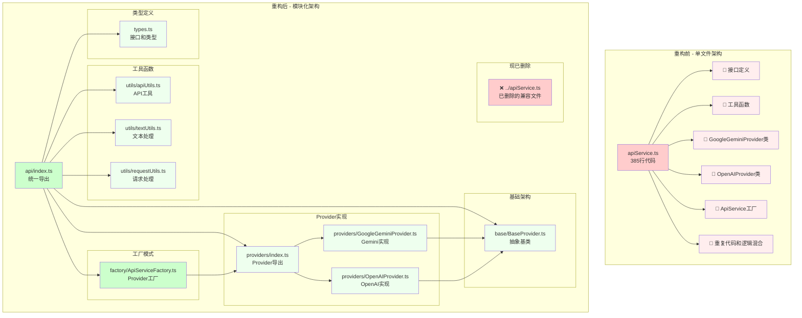

# 浸入式学语言助手 - 架构与功能详解

## 📋 目录

- [项目概览](#项目概览)
- [核心功能模块](#核心功能模块)
- [技术架构](#技术架构)
- [API参考](#api参考)
- [开发指南](#开发指南)
- [性能与优化](#性能与优化)
- [故障排除](#故障排除)

---

## 📖 项目概览

### 核心理念

浸入式学语言助手基于著名的 **"i+1"** 理论（可理解输入理论），通过智能地将网页内容中的部分词汇替换为目标语言，创造一个沉浸式的语言学习环境。用户在日常浏览网页的过程中，自然地接触和学习新的词汇，实现"润物细无声"的语言学习体验。

**🎯 项目亮点**: 集成了完整的发音学习生态系统和智能多语言翻译功能，包括自动语言检测、音标显示、AI词义解释、双TTS语音合成和交互式悬浮框，为用户提供从智能翻译到发音学习的一站式沉浸式体验。

### 技术栈

- **前端框架**: Vue 3 + TypeScript
- **构建工具**: WXT (WebExtension框架)
- **开发工具**: Vite + ESLint + Prettier
- **API集成**: OpenAI兼容接口、Dictionary API、有道TTS
- **架构模式**: Provider模式 + 模块化设计 + 事件驱动
- **发音系统**: 工厂模式 + 多TTS服务 + 智能缓存
- **多语言支持**: 20+种语言的智能检测和翻译（理论基于AI模型能力）
- **浏览器支持**: Chrome、Edge、Firefox、Safari（部分支持）

### 整体架构

```
浸入式学语言助手
├── 🎯 核心翻译引擎
│   ├── 智能语言检测系统（AI自动识别源语言）
│   ├── 智能文本处理系统（LLM分析选词）
│   ├── AI翻译服务（20+种语言支持）
│   └── 缓存与性能优化
├── 🔊 发音学习生态系统 ⭐
│   ├── 音标获取服务（Dictionary API）
│   ├── 多TTS语音合成（有道TTS + Web Speech）
│   ├── AI词义解释（实时生成中文释义）
│   ├── 交互式悬浮框（双层学习体验）
│   └── 智能缓存机制（24小时TTL音标缓存）
├── 🎨 用户界面层
│   ├── Vue 3 弹窗设置界面
│   ├── 7种翻译样式管理（含学习模式）
│   ├── 主题适配系统（深色/浅色）
│   └── 响应式悬浮提示系统
└── 🔧 基础设施层
    ├── 跨设备配置同步（Storage Manager）
    ├── 扩展消息传递系统
    ├── 跨浏览器兼容层
    └── 性能监控与优化
```

---

## 🚀 核心功能模块

### 1. 智能文本处理系统

**位置**: `src/modules/textProcessor.ts`

**核心职责**:
- DOM树遍历和文本节点提取
- 智能段落分组和长度控制
- 文本替换的精确定位和应用
- 动态内容监听和处理

**关键特性**:
```typescript
// 核心处理流程
public async processRoot(
  root: Node,
  textReplacer: TextReplacer,
  originalWordDisplayMode: OriginalWordDisplayMode,
  maxLength: number = 400
): Promise<void>
```

- **智能分组**: 按语义单元组织文本，平衡处理效率和上下文完整性
- **增量处理**: 只处理新增内容，避免重复翻译
- **DOM安全**: 使用Range API确保DOM结构完整性
- **性能优化**: 防抖机制避免频繁重复处理

**忽略策略**:
- 跳过代码块、脚本、样式等技术内容
- 避免处理已翻译或标记的内容
- 智能识别并保护隐藏或不可见元素

### 2. AI翻译服务（重构后模块化架构）

**位置**: `src/modules/api/` 模块

**架构说明**:
```
src/modules/api/
├── index.ts                    # 统一导出入口
├── types.ts                   # 接口和类型定义
├── base/
│   └── BaseProvider.ts        # 抽象基类，提供公共功能
├── providers/
│   ├── GoogleGeminiProvider.ts # Google Gemini API实现
│   ├── OpenAIProvider.ts      # OpenAI兼容API实现
│   └── index.ts               # Provider统一导出
├── utils/
│   ├── apiUtils.ts            # API相关工具函数
│   ├── textUtils.ts           # 文本处理工具函数
│   └── requestUtils.ts        # 请求处理工具函数
└── factory/
    └── ApiServiceFactory.ts   # API服务工厂
```

**核心职责**:
- 调用兼容OpenAI API的大语言模型
- 智能词汇选择和难度适配  
- 结构化翻译结果处理
- 错误处理和重试机制
- 模块化设计，易于扩展新的翻译服务

**API接口设计**:
```typescript
interface FullTextAnalysisResponse {
  original: string;           // 原始文本
  processed: string;          // 处理后文本（已弃用）
  replacements: Replacement[]; // 替换项数组
}

interface Replacement {
  original: string;    // 原文词汇
  translation: string; // 翻译结果
  position: {         // 位置信息
    start: number;
    end: number;
  };
  isNew: boolean;     // 是否为生词
  explanation?: string; // 额外解释
}
```

**智能翻译策略**:
- **智能语言检测**: AI自动识别网页源语言，无需用户手动指定语言类型
- **难度适配**: 根据用户语言水平调整词汇选择
- **比例控制**: 精确控制翻译词汇占总文本的比例（1%-100%字符级精确计算）
- **上下文感知**: 考虑语境选择最合适的翻译
- **多语言支持**: 支持20+种语言的智能翻译（英语、日语、韩语、法语、德语、西班牙语、俄语、意大利语、葡萄牙语、荷兰语、瑞典语、挪威语、丹麦语、芬兰语、波兰语、捷克语、土耳其语、希腊语等）
- **智能多语言模式**: 用户只需选择目标语言，AI自动检测源语言并进行翻译

### 3. 发音生态系统

**位置**: `src/modules/pronunciation/`

发音系统是项目的一大亮点，采用模块化架构设计，支持多种音标和语音合成服务。

#### 3.1 音标服务架构

```
pronunciation/
├── phonetic/              # 音标获取模块
│   ├── IPhoneticProvider.ts       # 音标服务接口
│   ├── DictionaryApiProvider.ts   # Dictionary API实现
│   └── PhoneticProviderFactory.ts # 音标服务工厂
├── tts/                   # 语音合成模块
│   ├── ITTSProvider.ts            # TTS服务接口
│   ├── WebSpeechTTSProvider.ts    # Web Speech API实现
│   ├── YoudaoTTSProvider.ts       # 有道TTS实现
│   └── TTSProviderFactory.ts      # TTS服务工厂
├── translation/           # AI翻译模块
│   └── AITranslationProvider.ts   # AI词义获取
├── services/              # 核心服务层
│   ├── PronunciationService.ts    # 发音服务协调器
│   └── TTSService.ts              # TTS服务管理器
├── ui/                    # 用户界面组件
│   ├── TooltipRenderer.ts         # 悬浮框渲染器
│   └── EventManager.ts            # 事件管理器
└── utils/                 # 工具函数
    ├── DOMUtils.ts               # DOM操作工具
    ├── PositionUtils.ts          # 位置计算工具
    └── TimerManager.ts           # 定时器管理
```

#### 3.2 PronunciationService核心功能

**主要职责**:
- 协调音标获取、AI翻译和语音合成
- 管理悬浮框的显示和隐藏逻辑
- 提供双层交互体验（短语→单词）
- 实现智能缓存和性能优化

**核心方法**:
```typescript
// 为翻译元素添加发音功能
async addPronunciationToElement(
  element: HTMLElement,
  word: string,
  isPhrase?: boolean
): Promise<boolean>

// 语音合成（支持主备双TTS）
async speakText(text: string): Promise<TTSResult>

// 获取音标信息
async getPhonetic(word: string): Promise<PhoneticResult>
```

#### 3.3 交互式悬浮框系统

**悬浮框类型**:
1. **单词悬浮框**: 显示音标、AI词义、朗读按钮
2. **短语悬浮框**: 显示可交互的单词列表
3. **嵌套悬浮框**: 短语中单个单词的详细信息

**智能显示逻辑**:
- 渐进式加载：先显示基础信息，再异步加载详细内容
- 智能定位：自动计算最佳显示位置，避免边界溢出
- 交互优化：支持鼠标悬停延迟、点击固定等交互模式

### 4. 样式管理系统

**位置**: `src/modules/styleManager.ts`

**核心功能**:
- 动态CSS注入和管理
- 多种翻译显示样式支持
- 主题适配和响应式设计
- 动画效果和交互反馈

**支持的样式类型**:
```typescript
enum TranslationStyle {
  DEFAULT = 'default',      // 默认蓝色样式
  SUBTLE = 'subtle',        // 微妙灰色样式
  BOLD = 'bold',           // 粗体样式
  ITALIC = 'italic',       // 斜体样式
  UNDERLINED = 'underlined', // 下划线样式
  HIGHLIGHTED = 'highlighted', // 高亮样式
  LEARNING = 'learning'     // 学习模式（模糊效果）
}
```

**高级样式特性**:
- **辉光动画**: 新翻译词汇出现时的柔和提示效果，不干扰阅读体验
- **学习模式**: 翻译词汇初始模糊显示，鼠标悬停时清晰化，增强记忆效果
- **响应式设计**: 自适应深色/浅色主题，智能悬浮框定位
- **无障碍支持**: 考虑色彩对比度和可读性


### 5. 配置与存储管理

**位置**: `src/modules/storageManager.ts`, `src/modules/types.ts`

**数据模型**:
```typescript
interface UserSettings {
  userLevel: UserLevel;                    // 用户语言水平（5个级别）
  replacementRate: number;                 // 翻译比例（1%-100%）
  isEnabled: boolean;                      // 功能开关
  useGptApi: boolean;                      // 使用AI翻译
  apiConfig: ApiConfig;                    // API配置
  translationStyle: TranslationStyle;      // 翻译样式（7种样式）
  triggerMode: TriggerMode;                // 触发模式（自动/手动）
  maxLength: number;                       // 段落最大长度
  translationDirection: string;            // 翻译方向/智能多语言模式
  originalWordDisplayMode: OriginalWordDisplayMode; // 原文显示模式
  enablePronunciationTooltip: boolean;     // 发音悬浮框开关
}

interface ApiConfig {
  apiKey: string;                          // API密钥
  apiEndpoint: string;                     // API端点
  model: string;                           // 模型名称
  temperature: number;                     // 温度参数（默认0.2）
}
```

**存储策略**:
- 使用 `browser.storage.sync` 实现跨设备同步
- 向后兼容的配置迁移机制
- 默认值保护和错误恢复
- 实时配置更新和消息传递

---

## 🏗️ 技术架构

### 模块化设计原则

项目采用高度模块化的架构，每个模块都有明确的职责边界和标准化的接口。

#### 1. 分层架构

```
┌─────────────────────────────────────┐
│           用户界面层 (UI Layer)         │
│  ┌─────────────┐ ┌─────────────────┐ │
│  │   Popup UI  │ │ Content Styles  │ │
│  └─────────────┘ └─────────────────┘ │
├─────────────────────────────────────┤
│          服务层 (Service Layer)        │
│  ┌─────────────┐ ┌─────────────────┐ │
│  │Pronunciation│ │  Text Processor │ │
│  │   Service   │ │                 │ │
│  └─────────────┘ └─────────────────┘ │
├─────────────────────────────────────┤
│         提供者层 (Provider Layer)      │
│  ┌─────────────┐ ┌─────────────────┐ │
│  │ API Service │ │   TTS/Phonetic  │ │
│  │             │ │    Providers    │ │
│  └─────────────┘ └─────────────────┘ │
├─────────────────────────────────────┤
│         基础设施层 (Infrastructure)    │
│  ┌─────────────┐ ┌─────────────────┐ │
│  │   Storage   │ │    Messaging    │ │
│  │   Manager   │ │     System      │ │
│  └─────────────┘ └─────────────────┘ │
└─────────────────────────────────────┘
```

#### 2. Provider模式实现

所有外部服务都通过Provider模式抽象：

```typescript
// 统一的Provider接口
interface IPhoneticProvider {
  getName(): string;
  getPhonetic(word: string): Promise<PhoneticResult>;
}

// 工厂模式创建Provider实例
class PhoneticProviderFactory {
  static createProvider(providerName: string): IPhoneticProvider {
    switch (providerName) {
      case 'dictionary-api':
        return new DictionaryApiProvider();
      default:
        throw new Error(`Unknown provider: ${providerName}`);
    }
  }
}
```

#### 3. 事件驱动架构

系统采用事件驱动的消息传递机制：

```typescript
// 消息类型定义
interface MessageTypes {
  'settings_updated': { settings: UserSettings };
  'MANUAL_TRANSLATE': {};
  'validate-configuration': { source: string };
}

// 统一的消息处理
browser.runtime.onMessage.addListener((message, sender, sendResponse) => {
  switch (message.type) {
    case 'settings_updated':
      handleSettingsUpdate(message.settings);
      break;
    // ... 其他消息处理
  }
});
```

### 数据流设计

#### 1. 翻译处理流程

```
用户访问网页
    ↓
DOM内容解析和文本提取
    ↓
文本分组和长度控制
    ↓
AI API调用和翻译获取
    ↓
替换结果定位和应用
    ↓
样式应用和动画效果
    ↓
发音功能注册（可选）
```

#### 2. 发音服务流程

```
用户鼠标悬停翻译词汇
    ↓
触发发音服务注册
    ↓
并行异步加载：
├─ 音标获取 (Dictionary API)
├─ AI词义获取 (OpenAI API)
└─ TTS服务准备 (有道/Web Speech)
    ↓
渲染悬浮框界面
    ↓
用户交互：播放语音、查看词义
```

### 扩展性机制

#### 1. 插件式Provider

新的API服务可以通过实现标准接口轻松集成：

```typescript
// 新增翻译服务
class NewTranslationProvider implements ITranslationProvider {
  async translate(text: string, options: TranslationOptions): Promise<TranslationResult> {
    // 实现具体翻译逻辑
  }
}

// 在工厂中注册
TranslationProviderFactory.register('new-service', NewTranslationProvider);
```

#### 2. 主题和样式扩展

样式系统支持自定义主题：

```typescript
// 新增翻译样式
enum CustomTranslationStyle {
  NEON = 'neon',
  GRADIENT = 'gradient'
}

// 在样式管理器中注册
styleManager.registerStyle('neon', {
  color: '#00ff00',
  textShadow: '0 0 10px #00ff00'
});
```

---

## 📖 使用指南和测试文档

**详细的API使用方法、测试指南、调试技巧和故障排除，请参考：**

📚 **[TEST_DOC.md](./TEST_DOC.md)** - 完整的使用指南与测试文档

该文档包含：
- ✅ **UniversalApiService 通用AI服务** - 新增的通用大模型调用能力
- ✅ **API参考与使用示例** - 翻译服务、发音服务、设置管理等完整API
- ✅ **测试指南** - 自动化测试和手动测试检查清单
- ✅ **调试技巧** - 性能监控、错误诊断、网络调试等
- ✅ **故障排除** - 常见问题解决方案和错误代码参考
- ✅ **性能优化建议** - 缓存策略、内存管理、批量处理等
```

#### 请求处理工具函数
```typescript
import { sendApiRequest } from '@/src/modules/api';

// 发送API请求（支持后台代理）
const response = await sendApiRequest(
  requestBody,    // 请求体
  apiConfig,      // API配置
  0              // 超时时间（0表示无限制）
);
```

### 文本处理API

#### 处理页面内容
```typescript
import { TextProcessor } from '@/src/modules/textProcessor';
import { TextReplacer } from '@/src/modules/textReplacer';
import { OriginalWordDisplayMode } from '@/src/modules/types';

const textProcessor = new TextProcessor(true); // 启用发音功能
const textReplacer = new TextReplacer(config);

await textProcessor.processRoot(
  document.body,                           // 根节点
  textReplacer,                           // 文本替换器
  OriginalWordDisplayMode.VISIBLE,        // 原文显示模式
  400                                     // 最大段落长度
);
```

#### 替换文本
```typescript
import { ReplacementConfig } from '@/src/modules/types';

const config: ReplacementConfig = {
  userLevel: UserLevel.INTERMEDIATE,
  replacementRate: 0.3,
  useGptApi: true,
  translationStyle: TranslationStyle.DEFAULT,
  translationDirection: 'intelligent'
};

const textReplacer = new TextReplacer(config);
const result = await textReplacer.replaceText("这是一段中文文本");

console.log(result.replacements); // 替换项数组
```

### 样式管理API

#### 设置翻译样式
```typescript
const styleManager = new StyleManager();
styleManager.setTranslationStyle(TranslationStyle.HIGHLIGHTED);
```

#### 获取当前样式类名
```typescript
const className = styleManager.getCurrentStyleClass();
// 返回: "wxt-style-highlighted"
```

---

## 💻 开发指南

### 环境配置

#### 1. 系统要求
- Node.js 18+ 
- npm 或 pnpm
- 支持WebExtension的浏览器

#### 2. 安装依赖
```bash
git clone https://github.com/xiao-zaiyi/illa-helper.git
cd illa-helper
npm install
```

#### 3. 环境变量配置
```bash
# 复制环境变量模板
cp .env.example .env

# 编辑配置文件
# 至少需要配置API密钥
    VITE_WXT_DEFAULT_API_KEY="sk-your-api-key"
    VITE_WXT_DEFAULT_API_ENDPOINT="https://api.openai.com/v1/chat/completions"
    VITE_WXT_DEFAULT_MODEL="gpt-4"
    VITE_WXT_DEFAULT_TEMPERATURE="0.2"
```

#### 4. 开发运行
```bash
# 开发模式（Chrome）
npm run dev

# 开发模式（Firefox）
npm run dev:firefox

# 生产构建
npm run build

# 打包扩展
npm run zip
```

### 代码结构规范

#### 1. 目录组织
```
src/modules/
├── [功能模块]/
│   ├── index.ts          # 模块主入口
│   ├── types.ts          # 类型定义
│   ├── config.ts         # 配置常量
│   ├── services/         # 服务层
│   ├── providers/        # 提供者实现
│   └── utils/           # 工具函数
```

#### 2. 命名规范
- **文件名**: 使用PascalCase（如 `TextProcessor.ts`）
- **类名**: PascalCase（如 `class TextProcessor`）
- **接口名**: 以 `I` 开头（如 `interface IPhoneticProvider`）
- **方法名**: camelCase（如 `processText()`）
- **常量**: UPPER_SNAKE_CASE（如 `DEFAULT_CONFIG`）

#### 3. TypeScript规范
```typescript
// 使用严格的类型定义
interface StrictInterface {
  required: string;
  optional?: number;
}

// 避免使用 any，使用泛型
function processData<T>(data: T): Promise<T> {
  return Promise.resolve(data);
}

// 使用联合类型而非字符串
type Theme = 'light' | 'dark' | 'auto';
```

### 新功能开发流程

#### 1. 添加新的翻译Provider（新架构）
```typescript
// 1. 在 src/modules/api/providers/ 目录下创建新文件
// 例如：ClaudeProvider.ts

import { BaseProvider } from '../base/BaseProvider';
import { UserSettings, FullTextAnalysisResponse } from '../../types';

export class ClaudeProvider extends BaseProvider {
  protected getProviderName(): string {
    return 'Claude';
  }

  protected async doAnalyzeFullText(
    text: string,
    settings: UserSettings,
  ): Promise<FullTextAnalysisResponse> {
    // 实现Claude API调用逻辑
    const response = await this.callClaudeAPI(text, settings);
    return this.parseClaudeResponse(response, text);
  }

  private async callClaudeAPI(text: string, settings: UserSettings) {
    // Claude API调用实现
    const config = this.getConfig();
    // ... 具体实现
  }

  private parseClaudeResponse(response: any, originalText: string): FullTextAnalysisResponse {
    // 解析Claude响应格式
    // ... 具体实现
  }
}

// 2. 在 providers/index.ts 中导出
export { ClaudeProvider } from './ClaudeProvider';

// 3. 在 ApiServiceFactory.ts 中添加创建逻辑
import { ClaudeProvider } from '../providers';

export class ApiServiceFactory {
  static createProvider(activeConfig: ApiConfigItem): ITranslationProvider {
    const { provider, config } = activeConfig;

    switch (provider) {
      case TranslationProvider.Claude:  // 添加新的枚举值
        return new ClaudeProvider(config);
      // ... 其他Provider
    }
  }
}

// 4. 在 types.ts 中添加新的Provider类型
enum TranslationProvider {
  // ... 现有类型
  Claude = 'claude'
}
```

#### 2. 添加新的样式
```typescript
// 1. 扩展样式枚举
enum TranslationStyle {
  // ... 现有样式
  NEW_STYLE = 'new-style'
}

// 2. 在样式管理器中添加CSS
private initializeStyles(): void {
  const styleElement = document.createElement('style');
  styleElement.textContent = `
    /* ... 现有样式 */
    .wxt-style-new-style {
      /* 新样式定义 */
    }
  `;
}
```

#### 3. 添加新的配置选项
```typescript
// 1. 扩展用户设置接口
interface UserSettings {
  // ... 现有设置
  newOption: boolean;
}

// 2. 更新默认设置
const DEFAULT_SETTINGS: UserSettings = {
  // ... 现有默认值
  newOption: false
};

// 3. 在UI中添加控制组件
<div class="setting-group">
  <label>新功能选项</label>
  <input type="checkbox" v-model="settings.newOption" />
</div>
```

---

## 📞 技术支持与贡献

### 贡献指南

我们欢迎各种形式的贡献！请查看主项目的 [README.md](../README.md) 了解如何参与贡献。

### 技术讨论

- **GitHub Issues**: 报告错误和功能请求
- **Pull Requests**: 代码贡献和改进
- **Discussions**: 技术讨论和经验分享

### 开发路线图

#### 已完成特性 ✅
- [x] 智能语言检测（AI自动识别源语言）
- [x] 智能多语言模式（20+种语言支持）
- [x] 完整发音学习生态系统（音标+AI词义+双TTS）
- [x] 交互式悬浮框系统（双层学习体验）
- [x] 7种翻译样式（含学习模式）
- [x] 主题适配系统（深色/浅色）
- [x] 智能缓存机制（多级缓存优化）
- [x] **API模块重构**（模块化架构，易于扩展）

#### 规划中特性 🚀
- [ ] 增加单词收藏和复习功能
- [ ] 实现学习进度追踪
- [ ] 支持自定义词库导入
- [ ] 增加语法分析和句型学习
- [ ] 开发移动端伴侣应用
- [ ] 支持更多TTS服务（Azure、Google等）

---

## 📋 API迁移指南

### 从旧API迁移到新API

如果您之前使用旧的API，请按照以下步骤进行迁移：

#### 1. 导入语句更新

```typescript
// 旧版本 (已废弃)
import { ApiService } from '@/src/modules/apiService';

// 新版本 (推荐)
import { ApiServiceFactory } from '@/src/modules/api';
```

#### 2. 创建Provider实例

```typescript
// 旧版本
const provider = ApiService.createProvider(activeConfig);

// 新版本 (方法名相同，但使用新的工厂类)
const provider = ApiServiceFactory.createProvider(activeConfig);
```

#### 3. 导入工具函数

```typescript
// 旧版本 (直接从apiService导入)
import { mergeCustomParams } from '@/src/modules/apiService';

// 新版本 (从api模块导入)
import { mergeCustomParams } from '@/src/modules/api';
```

#### 4. 扩展新Provider

```typescript
// 旧版本 (需要修改apiService.ts文件)
// 在单个文件中添加新的Provider类...

// 新版本 (创建独立文件)
// 1. 在 src/modules/api/providers/ 下创建新文件
// 2. 继承 BaseProvider
// 3. 在工厂中注册
```

### 迁移检查清单

- [ ] 更新所有导入语句从 `./apiService` 到 `./api`
- [ ] 将 `ApiService` 替换为 `ApiServiceFactory`
- [ ] 检查自定义Provider是否需要重构为新的架构
- [ ] 验证所有API调用正常工作
- [ ] 更新相关测试代码

### 迁移优势

- ✅ **模块化设计**: 更清晰的代码组织
- ✅ **易于扩展**: 添加新Provider更简单  
- ✅ **更好的测试**: 各模块可独立测试
- ✅ **类型安全**: 更严格的TypeScript类型检查
- ✅ **代码复用**: 公共功能通过BaseProvider共享

---

### 


## 📚 快速开始 - 新API使用指南

### 基础翻译服务使用

```typescript
// 1. 导入必要的模块
import { ApiServiceFactory } from '@/src/modules/api';
import { StorageManager } from '@/src/modules/storageManager';

// 2. 获取用户设置和配置
const storageManager = new StorageManager();
const settings = await storageManager.getUserSettings();

// 3. 获取当前活跃的API配置
const activeConfig = settings.apiConfigs.find(
  config => config.id === settings.activeApiConfigId
);

// 4. 创建翻译提供者
const provider = ApiServiceFactory.createProvider(activeConfig);

// 5. 执行翻译
const result = await provider.analyzeFullText('Hello World', settings);
console.log(result.replacements); // 查看替换结果
```

### 支持的Provider类型

```typescript
import { TranslationProvider } from '@/src/modules/types';

// 支持的Provider类型
enum TranslationProvider {
  OpenAI = 'openai',           // OpenAI API
  GoogleGemini = 'gemini',     // Google Gemini API  
  ProxyGemini = 'proxy-gemini', // 代理Gemini API
  DeepSeek = 'deepseek',       // DeepSeek API
  SiliconFlow = 'siliconflow'  // SiliconFlow API
}
```

### 检查工厂支持的Provider

```typescript
import { ApiServiceFactory } from '@/src/modules/api';

// 获取支持的Provider列表
const supportedProviders = ApiServiceFactory.getSupportedProviders();
console.log('支持的Provider:', supportedProviders);

// 检查特定Provider是否受支持
const isSupported = ApiServiceFactory.isProviderSupported(TranslationProvider.OpenAI);
console.log('OpenAI是否支持:', isSupported);
```

### 错误处理最佳实践

```typescript
import { ApiServiceFactory, createErrorResponse } from '@/src/modules/api';

async function safeTranslate(text: string, settings: UserSettings) {
  try {
    const activeConfig = settings.apiConfigs.find(
      config => config.id === settings.activeApiConfigId
    );
    
    if (!activeConfig) {
      console.error('未找到活跃的API配置');
      return createErrorResponse(text);
    }
    
    const provider = ApiServiceFactory.createProvider(activeConfig);
    const result = await provider.analyzeFullText(text, settings);
    
    // 检查结果是否有效
    if (!result.replacements || result.replacements.length === 0) {
      console.warn('翻译结果为空');
    }
    
    return result;
  } catch (error) {
    console.error('翻译过程中发生错误:', error);
    return createErrorResponse(text);
  }
}
```

### 自定义Provider开发

```typescript
import { BaseProvider } from '@/src/modules/api';
import { UserSettings, FullTextAnalysisResponse, ApiConfig } from '@/src/modules/types';

// 1. 继承BaseProvider创建自定义Provider
class MyCustomProvider extends BaseProvider {
  protected getProviderName(): string {
    return 'My Custom Provider';
  }

  protected async doAnalyzeFullText(
    text: string,
    settings: UserSettings,
  ): Promise<FullTextAnalysisResponse> {
    // 实现自定义翻译逻辑
    const replacements = await this.customTranslateLogic(text, settings);
    
    return {
      original: text,
      processed: '',
      replacements,
    };
  }

  private async customTranslateLogic(text: string, settings: UserSettings) {
    // 自定义翻译实现
    // 可以调用第三方API或本地算法
    return [];
  }
}

// 2. 扩展工厂以支持新Provider
// 需要在 ApiServiceFactory.ts 中添加：
// case 'my-custom':
//   return new MyCustomProvider(config);
```

### 高级配置示例

```typescript
import { ApiConfig, TranslationProvider } from '@/src/modules/types';

// 完整的API配置示例
const customApiConfig: ApiConfig = {
  apiKey: 'your-api-key',
  apiEndpoint: 'https://api.custom-service.com/v1/chat/completions',
  model: 'gpt-4-turbo',
  temperature: 0.2,
  useBackgroundProxy: false,           // 是否使用后台代理
  requestsPerSecond: 2,               // 每秒请求限制
  customParams: JSON.stringify({       // 自定义参数
    max_tokens: 1000,
    top_p: 0.9,
    frequency_penalty: 0.1
  }),
  includeThinkingParam: false,        // 是否包含thinking参数
  enable_thinking: false              // 启用thinking模式
};

// 使用自定义配置
const provider = ApiServiceFactory.createProvider({
  id: 'custom-config',
  provider: TranslationProvider.OpenAI,
  config: customApiConfig
});
```